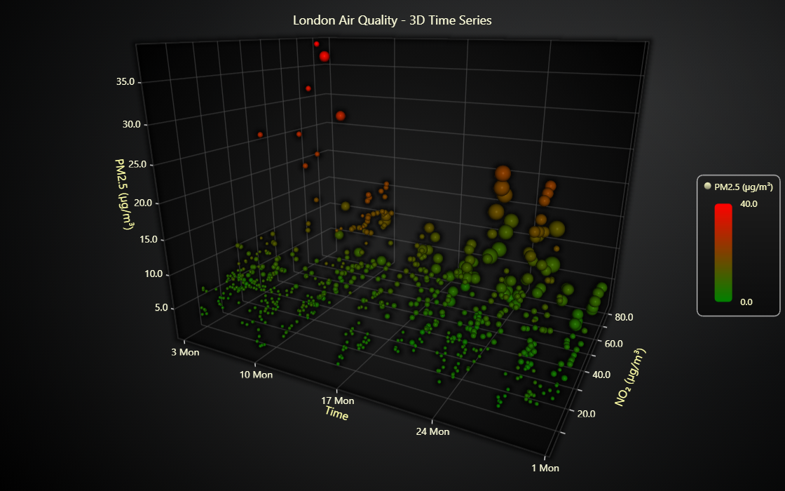

# JavaScript 3D Time Series



This demo application belongs to the set of examples for LightningChart JS, data visualization library for JavaScript.

LightningChart JS is entirely GPU accelerated and performance optimized charting library for presenting massive amounts of data. It offers an easy way of creating sophisticated and interactive charts and adding them to your website or web application.

The demo can be used as an example or a seed project. Local execution requires the following steps:

-   Make sure that relevant version of [Node.js](https://nodejs.org/en/download/) is installed
-   Open the project folder in a terminal:

          npm install              # fetches dependencies
          npm start                # builds an application and starts the development server

-   The application is available at _http://localhost:8080_ in your browser, webpack-dev-server provides hot reload functionality.


## Description

This example uses pollution data from a London monitoring site to show how PM2.5 and NO₂ levels change over time. The PM2.5 levels are shown with a **LUT-based paletted fill**, and NO₂ markers progressively scale in size.
Together, these visual changes make it easy to perceive how shifts in one pollutant line up with those in the other, highlighting possible correlations.

The example also demonstrates proper configuration of a **UTC DateTime axis** in **3D charts**.

In XY charts, it is enough just to set axis type as "linear-highPrecision" when using UTC timestamps. However, this feature is not supported by 3D charts. 
Instead, "date time origin shift" approach has to be used. It means manually shifting timestamps data closer to 0. This is ultimately required due to low webgl number precision.

```javascript
const dateOrigin = new Date(data[0].gps_timestamp) // usually can also be set to just new Date(), i.e. current date
const dateOriginTime = dateOrigin.getTime()
chart.axisX.setTickStrategy(AxisTickStrategies.DateTime, strategy => strategy
    .setDateOrigin(dateOrigin)
)

series.add(data.map(p => ({
  x: p.x - dateOriginTime,
  y: p.y,
  z: p.z
})))
```

The data used in this example: [OpenAQ Air Quality Data](https://explore.openaq.org/locations/270693)
Location: Waterloo Place (The Crown Estate), London, UK
Time period: November 2–30, 2025

## API Links

* [3D chart]
* [3D point series]
* [Axis tick strategies]
* [LUT]
* [Point styles]


## Support

If you notice an error in the example code, please open an issue on [GitHub][0] repository of the entire example.

Official [API documentation][1] can be found on [LightningChart][2] website.

If the docs and other materials do not solve your problem as well as implementation help is needed, ask on [StackOverflow][3] (tagged lightningchart).

If you think you found a bug in the LightningChart JavaScript library, please contact sales@lightningchart.com.

Direct developer email support can be purchased through a [Support Plan][4] or by contacting sales@lightningchart.com.

[0]: https://github.com/Arction/
[1]: https://lightningchart.com/lightningchart-js-api-documentation/
[2]: https://lightningchart.com
[3]: https://stackoverflow.com/questions/tagged/lightningchart
[4]: https://lightningchart.com/support-services/

© LightningChart Ltd 2009-2025. All rights reserved.


[3D chart]: https://lightningchart.com/js-charts/api-documentation/v8.1.0/classes/Chart3D.html
[3D point series]: https://lightningchart.com/js-charts/api-documentation/v8.1.0/classes/PointSeries3D.html
[Axis tick strategies]: https://lightningchart.com/js-charts/api-documentation/v8.1.0/variables/AxisTickStrategies.html
[LUT]: https://lightningchart.com/js-charts/api-documentation/v8.1.0/classes/LUT.html
[Point styles]: https://lightningchart.com/js-charts/api-documentation/v8.1.0/variables/PointStyle3D.html

